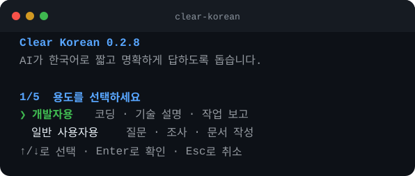

# Clear Korean

AI가 한국어로 짧고 명확하게 답하도록 만드는 지침 모음입니다. 자연스러운 한국어뿐 아니라 답변 길이, 사실과 추측의 구분, 사용자의 지식 수준에 맞춘 설명을 함께 다룹니다.

## 적용 효과 예시

Clear Korean을 적용하면 답변의 정보 순서, 사실 범위와 문장 밀도가 달라집니다. 아래 문장은 각 원칙의 차이를 보여 주는 대표 예시입니다.

### 작업 완료 보고

| 구분 | 답변 |
| --- | --- |
| 적용 전 | 요청하신 검색 인덱스 교체 작업을 완료했습니다. 관련 코드를 검토하고 테스트를 차례로 실행했습니다. |
| 적용 후 | 검색 인덱스 교체를 마쳤다. 단위 테스트 84개와 통합 테스트 12개가 모두 통과했다. 운영 트래픽에서는 아직 검증하지 못했다. |

**달라지는 점:** 수행 과정 대신 결과, 검증 범위와 남은 제한을 먼저 밝힙니다.

### 장애 현황

| 구분 | 답변 |
| --- | --- |
| 적용 전 | 결제 API가 느려졌습니다. 서버 부하나 네트워크 문제가 원인인 것으로 보이며 현재 조사 중입니다. |
| 적용 후 | 결제 API 배포 후 응답 시간이 180ms에서 420ms로 늘었다. 오류율에는 변화가 없다. 원인은 아직 확인되지 않았다. |

**달라지는 점:** 확인된 수치를 보존하고 주어지지 않은 원인이나 조사 상황을 만들지 않습니다.

### 오류 보고

| 구분 | 답변 |
| --- | --- |
| 적용 전 | 빌드 실패. 타입 문제로 보임. 관련 부분을 확인해보겠습니다. |
| 적용 후 | `UserProfile`의 타입이 일치하지 않아 빌드가 실패했다. `email` 필드가 선택 사항으로 선언된 부분을 수정해야 한다. |

**달라지는 점:** 무엇이 실패했는지와 확인된 원인을 구체적으로 밝히고 막연한 진행 계획은 덧붙이지 않습니다.

### 코드 리뷰 시작

| 구분 | 답변 |
| --- | --- |
| 적용 전 | unstaged 파일 3개의 frozen diff를 security와 logic 관점의 모델에 전달해 리뷰를 진행하겠습니다. |
| 적용 후 | 변경된 파일 3개를 검토한다. 보안 취약점과 논리 오류를 중심으로 확인한다. |

**달라지는 점:** 내부 도구의 상태와 처리 절차 대신 사용자가 알아야 할 검토 대상과 관점을 알립니다.

### 서버 점검 결과

| 구분 | 답변 |
| --- | --- |
| 적용 전 | 서버는 대체로 정상이며 systemd 상태만 degraded입니다. wallet watcher는 healthcheck가 없습니다. |
| 적용 후 | 서버와 네트워크는 현재 정상 동작한다. 부팅 중 네트워크 대기 서비스가 시간 초과로 실패한 기록이 있으며, 지갑 감시 서비스에는 상태 확인 기능이 설정되지 않았다. |

**달라지는 점:** 내부 상태명과 불필요한 영어를 옮기지 않고 실제 상태, 원인과 제한을 설명합니다.

### 고객 공지

| 구분 | 답변 |
| --- | --- |
| 적용 전 | 더 나은 서비스를 제공하기 위한 결제 시스템 점검이 예정되어 있습니다. 이용에 불편을 드려 죄송합니다. |
| 적용 후 | 8월 22일 오전 2시부터 3시까지 결제 시스템을 점검합니다. 카드 결제는 최대 10분간 중단될 수 있으며 계좌이체는 정상 이용할 수 있습니다. |

**달라지는 점:** 상투적인 문구보다 시간과 고객 영향을 먼저 알립니다.

### 자료 기반 요약

| 구분 | 답변 |
| --- | --- |
| 적용 전 | 매출은 전월보다 7% 늘었습니다. 주문 수는 3% 줄어 객단가 상승이 매출 증가를 이끈 것으로 보입니다. |
| 적용 후 | 매출은 전월보다 7% 늘었습니다. 주문 수는 3% 줄었으며, 제공된 자료만으로는 두 변화의 원인을 알 수 없습니다. |

**달라지는 점:** 자료에 없는 원인을 자연스럽게 보이도록 덧붙이지 않습니다.

### 전문 기술 설명

| 구분 | 답변 |
| --- | --- |
| 적용 전 | MVCC는 여러 트랜잭션이 동시에 데이터를 처리하는 방식입니다. 먼저 기본 개념부터 살펴보겠습니다. |
| 적용 후 | 장기 트랜잭션이 `xmin`을 붙잡으면 vacuum이 오래된 XID를 충분히 freeze하지 못한다. 새 트랜잭션이 XID를 계속 소비하면 wraparound 한계에 가까워지고, PostgreSQL은 쓰기를 거부할 수 있다. |

**달라지는 점:** 사용자가 이미 아는 기초 정의를 반복하지 않고 요청한 인과관계부터 설명합니다.

### 모델 평가 계획

| 구분 | 답변 |
| --- | --- |
| 적용 전 | screening benchmark에서 false positive, severity, fix 실행 가능성과 JSON contract 성공률을 평가해 기본 panel과 recovery 모델을 선정합니다. |
| 적용 후 | 후보 모델이 결함을 얼마나 정확히 찾는지 평가한다. 오탐 수, 심각도 판단, 수정안의 실행 가능성, JSON 형식 준수율을 비교해 주로 사용할 모델과 실패할 때 대신 사용할 모델을 정한다. |

**달라지는 점:** 내부 평가명과 분류명을 나열하지 않고 평가 목적, 측정 기준과 모델의 역할을 자연스러운 한국어로 설명합니다.

### 선택지 비교

| 구분 | 답변 |
| --- | --- |
| 적용 전 | 외장 SSD와 클라우드는 각각 장단점이 있으므로 상황에 따라 선택하면 됩니다. |
| 적용 후 | 비용은 외장 SSD가 유리하고, 고장 위험과 접근성은 클라우드가 유리하다. 5년 이상 보관할 사진이라면 장치 고장과 분실 위험을 줄이는 클라우드를 추천한다. |

**달라지는 점:** 판단 기준별 차이를 밝히고 요청한 추천까지 제공합니다.

### 문장 교정

| 구분 | 답변 |
| --- | --- |
| 적용 전 | 담당자가 확인 후 연락 드릴께요. |
| 적용 후 | 원문: ‘담당자가 확인 후 연락 드릴께요’<br>교정: ‘담당자가 확인한 후 연락드릴게요.’ |

**달라지는 점:** 원문은 보존하고 교정문을 별도로 구분합니다.

### 불필요한 명사화

| 구분 | 답변 |
| --- | --- |
| 적용 전 | 설정에 대한 검토를 진행한 후 결과에 대한 공유를 진행하겠습니다. |
| 적용 후 | 설정을 검토한 뒤 결과를 공유하겠습니다. |

**달라지는 점:** 명사를 이어 붙이지 않고 구체적인 동사로 줄입니다.

고정된 12개 문체를 비교한 실측 결과와 한계는 [한국어 문체 효과 평가](docs/STYLE_EVALUATION.md)에서 확인할 수 있습니다.

## 제공 내용

용도와 말투를 조합한 네 가지 완성본을 제공합니다.

| 대상 | 말투 | 파일 |
| --- | --- | --- |
| 개발자용 | 간결한 평서형 | [`presets/developer/plain/`](presets/developer/plain/) |
| 개발자용 | 정중한 존댓말 | [`presets/developer/polite/`](presets/developer/polite/) |
| 일반 사용자용 | 간결한 평서형 | [`presets/general/plain/`](presets/general/plain/) |
| 일반 사용자용 | 정중한 존댓말 | [`presets/general/polite/`](presets/general/polite/) |

각 디렉터리에는 내용이 같은 세 파일이 있습니다. 사용하는 환경에 맞는 이름을 고르면 됩니다.

- `AGENTS.md`: Codex 전역 또는 프로젝트 지침
- `CLAUDE.md`: Claude Code 전역 또는 프로젝트 지침
- `INSTRUCTIONS.md`: ChatGPT, Claude 앱, Gemini 등에서 복사해 쓸 수 있는 일반 지침

기존 `presets/developer/*.md`와 `presets/general/*.md` 경로는 평서형 호환 경로입니다.

## 배포 방식

초기 버전은 **GitHub 저장소, 독립된 Markdown 파일과 CLI**를 정식 배포 경로로 사용합니다.

- Markdown: 파일을 검토한 뒤 직접 복사하려는 사용자에게 적합합니다.
- CLI: 지침 출력, 자동 삽입·갱신, 상태 확인과 제거를 제공합니다.
- 웹사이트: 지침 비교, 미리보기와 클립보드 복사 UI가 필요할 때 추가합니다. 브라우저는 로컬 설정 파일을 직접 수정할 수 없으므로 자동 설치 수단으로 사용하지 않습니다.
- GitHub 주소: `https://github.com/x-mesh/clear-korean`을 기준 주소로 사용합니다.

## 설치

### CLI로 설치

GitHub에서 바로 실행할 수 있습니다.

```bash
uvx --from git+https://github.com/x-mesh/clear-korean clear-korean --help
```

PyPI 배포판은 더 짧게 실행할 수 있습니다. `@latest`를 붙이면 새 버전이 있는지 확인한 뒤 실행합니다. 인자 없이 실행하면 대화형 설정이 열립니다.

```bash
uvx clear-korean@latest
```



`uvx clear-korean@latest setup`으로도 같은 화면을 열 수 있습니다. 시작 화면에는 CLI 버전이 표시됩니다. 단계별 화면에서 위·아래 방향키 또는 `j`/`k`로 이동하고 Enter로 선택합니다. 3단계에서 파일 설치와 지침 출력 중 하나를 고릅니다. 출력할 때는 대상과 범위를 묻지 않습니다. 설치할 때는 마지막 확인 화면에서 실제 대상 파일을 검토하거나 선택을 다시 시작할 수 있습니다. Esc나 Ctrl+C로 취소합니다.

`uvx clear-korean`처럼 버전을 생략하면 캐시가 유효한 동안 이전 버전이 실행될 수 있습니다. 이미 `uv tool install clear-korean`으로 설치했다면 다음 명령으로 갱신합니다.

```bash
uv tool upgrade clear-korean
```

대화형 설정에서 용도, 말투, 적용 대상, 범위와 실행 방법을 차례로 고릅니다. 터미널이 없는 자동화 환경에서는 아래 하위 명령을 사용합니다.

개발자용 지침을 Codex와 Claude Code의 사용자 전역 파일에 함께 설치합니다.

```bash
uvx clear-korean@latest install --agent all --scope user --preset developer --tone plain
```

현재 프로젝트에만 설치하려면 프로젝트 루트에서 실행합니다.

```bash
uvx clear-korean@latest install --agent all --scope project --preset developer --tone polite
```

CLI는 기존 파일 전체를 덮어쓰지 않습니다. Clear Korean 관리 마커 사이에만 지침을 삽입하거나 갱신하며, 파일을 변경하기 전에 같은 디렉터리에 `*.clear-korean.<timestamp>.bak` 백업을 만듭니다. 심볼릭 링크와 손상된 관리 마커는 자동 수정하지 않습니다.

쓰기 전에 변경 내용을 확인하려면 `--dry-run`을 사용합니다.

```bash
uvx clear-korean@latest install --agent codex --scope project --preset general --dry-run
```

상태 확인과 제거:

```bash
uvx clear-korean@latest status --agent all --scope user
uvx clear-korean@latest remove --agent all --scope user
```

전체 명령과 파일 안전 정책은 [CLI 문서](docs/CLI.md)에 정리되어 있습니다.

`AGENTS.override.md`가 있으면 Codex가 `AGENTS.md`보다 override 파일을 우선합니다. CLI는 이 상황을 경고하지만 override 파일을 자동 변경하지 않습니다.

### 출력만 받기

파일을 자동 수정하지 않고 지침만 표준 출력으로 받을 수 있습니다.

```bash
uvx clear-korean@latest print --preset developer --tone plain
uvx clear-korean@latest print --preset general --tone polite
```

출력을 검토한 뒤 직접 붙여넣거나 파일로 저장할 수 있습니다.

```bash
uvx clear-korean@latest print --preset developer > /tmp/clear-korean.md
```

### Markdown을 직접 설치

기존 지침 파일이 있다면 먼저 내용을 확인합니다. Clear Korean 파일로 바로 덮어쓰지 말고, 충돌하는 규칙을 정리한 뒤 병합합니다.

### Codex

개발자용 완성본인 [`presets/developer/AGENTS.md`](presets/developer/AGENTS.md)을 다음 위치 중 하나에 둡니다.

- 모든 프로젝트: `~/.codex/AGENTS.md`
- 한 프로젝트: 저장소 루트의 `AGENTS.md`

일반 사용자용이 필요하면 `presets/general/AGENTS.md`를 사용합니다. Codex는 새 세션을 시작할 때 지침을 다시 읽습니다.

### Claude Code

개발자용 완성본인 [`presets/developer/CLAUDE.md`](presets/developer/CLAUDE.md)을 다음 위치 중 하나에 둡니다.

- 모든 프로젝트: `~/.claude/CLAUDE.md`
- 한 프로젝트: 저장소 루트의 `CLAUDE.md`

일반 사용자용이 필요하면 `presets/general/CLAUDE.md`를 사용합니다. 새 세션을 시작한 뒤 `/context`에서 파일이 로드됐는지 확인할 수 있습니다.

### 일반 AI 환경

`presets/general/INSTRUCTIONS.md`의 본문을 개인별 지침이나 프로젝트 지침에 복사합니다. 코딩 작업이 중심이면 `presets/developer/INSTRUCTIONS.md`를 사용합니다.

## 설계 원칙

- 결론이나 작업 결과를 먼저 제시합니다.
- 간결성을 이유로 의미를 생략하지 않고, 명확성을 이유로 불필요하게 길게 쓰지 않습니다.
- 기본 문체는 존댓말이 아닌 간결한 평서형입니다. 필요한 상황에서는 사용자의 문체 요구를 우선합니다.
- 사용자가 이미 아는 기술 용어를 반복해서 정의하지 않습니다.
- 사용자 판단에 필요 없는 내부 상태명과 처리 절차를 빼고, 일반적인 평가·운영 개념은 자연스러운 한국어로 설명합니다.
- 쉬운 말과 예시는 정확성을 해치지 않는 범위에서만 사용합니다.
- 확인한 사실과 추측을 구분합니다.

## 개발

`instructions/`가 정본입니다. `presets/`의 완성본은 직접 수정하지 않습니다.

```bash
./scripts/build.sh
./scripts/check.sh
uvx --from . clear-korean --help
```

README의 터미널 화면은 실제 대화형 CLI 출력에서 생성합니다.

```bash
python3 scripts/capture_terminal.py
```

`scripts/check.sh`는 배포 파일 동기화, 파일 크기와 CLI 단위 테스트를 검사합니다. 행동 테스트 사례는 [`tests/cases.tsv`](tests/cases.tsv)에 있습니다. 실행 방법과 검증 기록은 [`tests/README.md`](tests/README.md)에서 관리합니다. 모델 실행은 비용과 환경 차이가 있으므로 기본 검사에 포함하지 않습니다.

12개 한국어 문체의 적용 전후 비교 결과는 [`docs/STYLE_EVALUATION.md`](docs/STYLE_EVALUATION.md)에 있습니다. 지침 후보를 26개 고정 문체와 기준 답안으로 채점하고 회귀를 검사하는 방법은 [`docs/BENCHMARK.md`](docs/BENCHMARK.md)에 정리했습니다. 지정한 provider 설정만 유지하며 Codex를 격리 실행하는 전역 명령은 [`docs/CODEX_ISOLATED.md`](docs/CODEX_ISOLATED.md)에서 설명합니다.

## 참고한 공식 문서

- [OpenAI: Custom instructions with AGENTS.md](https://developers.openai.com/codex/guides/agents-md)
- [OpenAI: Prompting](https://developers.openai.com/codex/prompting)
- [Anthropic: How Claude remembers your project](https://code.claude.com/docs/en/memory)
